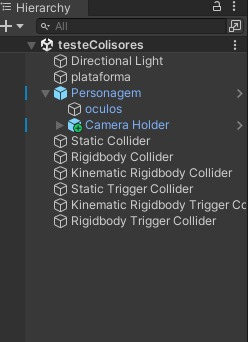

# UnityColliders
Esse projeto é um cena com obstáculos feito no Unity utilizando a linguagem C# onde são aplicados os conceitos de colisão e gatilho.

## Colliders e Triggers
### Colliders
Os colisores são o que impede que um corpo atravesse outro, a Unity utiliza esse conceito, anexando-os aos GameObjects, definindo a colisão física destes, e o desenvolvedor modela para que o colisor fique com o formato mais parecido possível do GameObject para que não fique muito aparente na hora de jogar.

### Triggers
Os gatilhos são um recurso da programação em que uma ação pode desencadear diversas reações por meio de eventos, estes que são definidos pelo script do colisor. O gatilho é uma propriedade dos colisores, a Is Trigger, e o gatilho é ativado quando essa propriedade está ativada. O objeto com o gatilho perde seu sistema de colisão, não impedindo nenhum outro objeto de passar, mas o evento será executado.

### Static Collider
Um Colisor Estático é um colisor aplicado a um objeto que não possui Rigidbody. Na cena, este colisor foi usado no retângulo amarelo.
  

### Static Trigger Collider
Esse gatilho é um Static Collider com a propriedade Is Trigger ativada. Na cena, este trigger foi utilizado no cilindro vermelho.
  

### Rigidbody Collider
Um Rigidbody Collider é um Rigidbody não cinemático com um colisor.  Na cena, este colisor foi usado na esfera rosa.
  

### Rigidbody Trigger Collider
Esse gatilho é um Rigidbody Collider com a propriedade Is Trigger ativada. Na cena, este trigger foi utilizado no cilindro azul.
  

### Kinematic Rigidbody Collider
Um Kinematic Rigidbody Collider é um Rigidbody cinemático, quando a propriedade Is Kinematic do Rigidbody está ativada, com um colisor. Na cena, este colisor foi utilizado no cilindro preto.
  

### Kinematic Rigidbody Trigger Collider
Esse gatilho é um Kinematic Rigidbody Collider com a propriedade Is Trigger ativada. Na cena, este trigger  foi utilizado na bola amarela.
  

## Desenvolvimento
Os GameObjects foram criados e colocados na cena, como o chão, o personagem do usuário e os GameObjects que receberam os colisores e os gatilhos. É adicionando os componentes em cada objeto que define sua cor, o rigidbody (dos objetos que o possuem), coloca o colisor e, nas propriedades do colisor, define se é ou não um gatilho.
  

## Link do Drive e do Asset Usado
https://drive.google.com/file/d/1E-siEpMUZjc9O_OU5gplQ-pnsDxKLfp_/view?usp=sharing
https://assetstore.unity.com/packages/templates/packs/obstacle-course-pack-178169
https://drive.google.com/file/d/1sf_-fUJc5IZOF3G79ADFxncYX0ISpupu/view?usp=drive_link

## Autores
Mariana Santiago e Yuri Telis